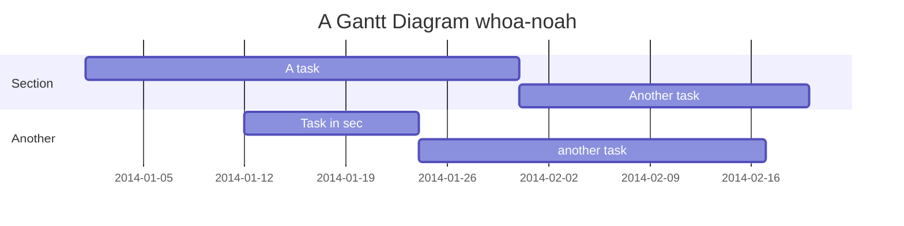

# Gantt chart

<!-- generated by mermaid compile action - START -->

  
Mermaid markup

```mermaid
gantt
    title A Gantt Diagram whoa-noah
    dateFormat  YYYY-MM-DD
    section Section
    A task           :a1, 2014-01-01, 30d
    Another task     :after a1  , 20d
    section Another
    Task in sec      :2014-01-12  , 12d
    another task      : 24d
```

<!-- generated by mermaid compile action - END -->
