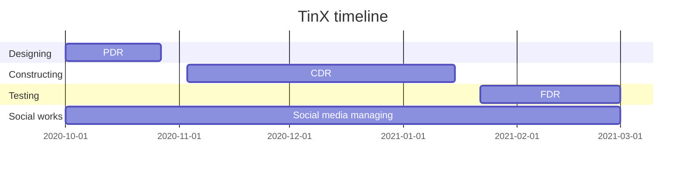

# Our Gantt timeline chart

<!--

        WHAT IS MERMAID
This is something simmilar to Makrdown, offering some nice graphs and charts written in plain text

        HOW TO EDIT THIS FILE 
Below (in code block with mermaid) is mermaid-style Gantt chart (written in text).
Our GitHub action generates .png file and puts it above the code block - so you can edit the text, and the image will update after few minutes.
Below are some commets that indicate where action generates stuff - usually you should not touch such places - but in this case,
you are free to edit stuf in mermaid code block.

        HOW TO WRITE MERMAID GANTT
Here is the Gantt section of Mermaid documentation: https://mermaid-js.github.io/mermaid/diagrams-and-syntax-and-examples/gantt.html
Here is the live mermaid editor: https://mermaid-js.github.io/mermaid-live-editor/
Generally, stick to the format where you just write begin and end date
-->

<!-- generated by mermaid compile action - START -->

  
Mermaid markup

<!-- generated by mermaid compile action - END -->
